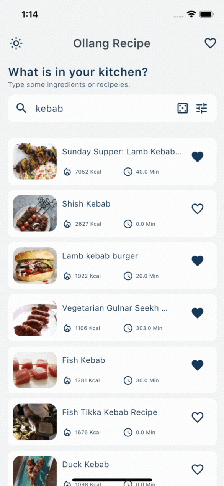

# ollang_recipe

Flutter recipe search app using Edamam api.

<br />

## Design on Figma

https://www.figma.com/file/ZvRMhOkxXv3AnvYFIJrQiH/Ollang-Case-Design?node-id=0%3A1&t=ofKfTfgznI8hOlNk-1

## Demo





## Features

- Random recipe
- Filter recipes
- Search history
- Favorite recipes
- Swipe to delete favorite recipes
- Lazy load for search results
- Theme mode
- Search recipe with name or ingredients
- Share recipe

## Used Packages and Versions

**Packages:** get, hive, hive_flutter, http, lottie, cached_network_image, share_plus, flutter_cache_manager

**Dart Version:** 2.19.6

**Flutter Version:** 3.7.9

<br />

## Used APIs

#### Get api schema from Edamam for getting available filters

```http
  GET https://api.edamam.com/doc/open-api/recipe-search-v2.json
```

#### Get search results from Edamam

```http
  GET https://api.edamam.com/api/recipes/v2
```
