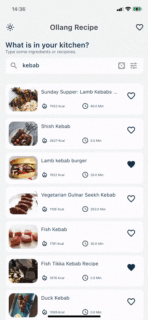

# ollang_recipe

Flutter recipe search app using Edamam api.

## Notes and Explanation

- Edamam api has a limit of 10 requests per minute.
- Search results coming with lazy load. So when user scrolls to bottom, it gets next page of results. (If you scroll too fast, api limit will be reached.)
- Some api text cant decoded properly. So I created a extension method for decoding text.
- Application use get package for state management.
- When app starts, it gets api schema from Edamam for getting available filters.
- Lottie package is used for animations.
- When app oppened, it gets some random recipes from Edamam. And shows it on home page. (Also there is a dice icon for getting random recipe. And showing details of it.)
- Calorie filter is not working properly on Edamam api.
- Hive storage is used for saving favorite recipes and search history.
- Share recipe by taking a screenshot with screenshot package.

<br />

## Design on Figma

https://www.figma.com/file/ZvRMhOkxXv3AnvYFIJrQiH/Ollang-Case-Design?node-id=0%3A1&t=ofKfTfgznI8hOlNk-1
[](https://www.figma.com/file/ZvRMhOkxXv3AnvYFIJrQiH/Ollang-Case-Design?node-id=0%3A1&t=ofKfTfgznI8hOlNk-1)

## Youtube Video

https://www.youtube.com/watch?v=A_3XZv1bx2g
[](https://www.youtube.com/watch?v=A_3XZv1bx2g)

## Demo





## Features

- Random recipe
- Filter recipes
- Search history
- Favorite recipes
- Swipe to delete favorite recipes
- Lazy load for search results
- Theme mode
- Search recipe with name or ingredients
- Share recipe by taking a screenshot with screenshot package

## Used Packages and Versions

**Packages:** get, hive, hive_flutter, http, lottie, cached_network_image, share_plus, flutter_cache_manager, screenshot

**Dart Version:** 2.19.6

**Flutter Version:** 3.7.9

<br />

## Used APIs

#### Get api schema from Edamam for getting available filters

```http
  GET https://api.edamam.com/doc/open-api/recipe-search-v2.json
```

#### Get search results from Edamam

```http
  GET https://api.edamam.com/api/recipes/v2
```
